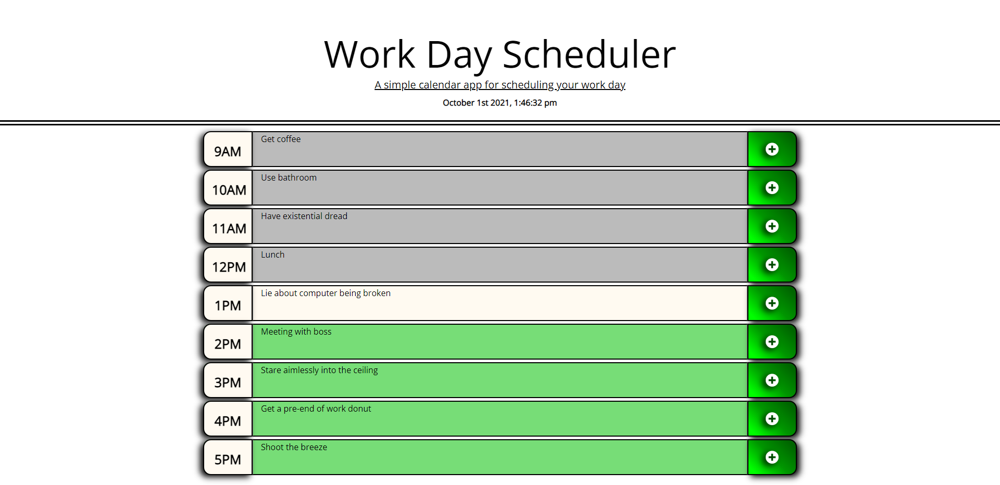

# Work Day Scheduler
site live at: https://t-norm.github.io/workday-scheduler/
--
The work day scheduler is a simple single day scheduling app that allows a user to build an event calender for their work day.
Infomration saved will persist after the browser is closed.
--
